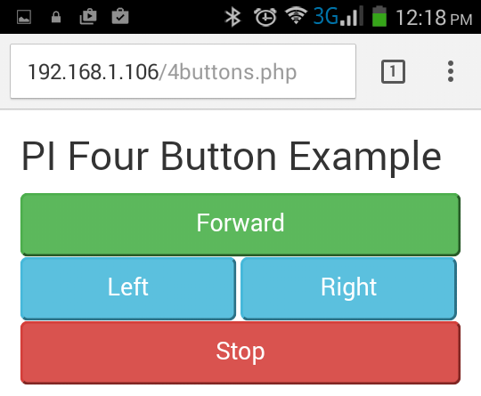

# PHP for Pi Mobile Controls
Use PHP to enable mobile devices to control Raspberry Pi projects

<h2>Goal to this Project</h2>

The goal of this project is to examine some of the pitfalls and issues around creating a mobile browser interface to a Raspberry Pi projects.

This projects look at:<br>

1. Interfacing PHP to Pi GPIO pins<br>
2. Managing PHP <form> interfacing where there are only buttons<br>
3. Creating a responsive design for PC, tablet and mobile browsers<br>


<h2>Base Apache and PHP Installation</h2>

There are some good installation procedure for installing Apache and PHP on the Raspberry Pi. A minimalist installation would be:<br>
```bash
sudo apt-get install apache2 -y
sudo apt-get install php5 libapache2-mod-php5 -y
```
<p>If everything is installed correctly the Apache home directory should be: <b>/var/www/html</b>.</p>
<p>To test that your installation is working open a browser on the Pi and go to: <b>http://localhost</b>. If the default (index.html) page comes up then you've install Apache correctly.</p>

<h2>PHP Interfacing to Pi GPIO</h2>
There are a few ways to access the GPIO pins in PHP:<br>
1. use a PHP library<br>
2. shell to the <b>gpio</b> command<br>

<p>Using a PHP library allows for a standard PHP interface, with an object model. From testing we found that the PHP libraries were not as flexible as the standard gpio command. For example you are not able to access PiFace pins (pin numbers > 200).

<h2>Installing PHP GPIO Library</h2>

<p>To install PHP libraries the recommended approach is to use [Composer](https://getcomposer.org/). It is important to define a PHP/Pi Web directory. For simple installations everything could be put in the default <i>/var/www/html</i> directory, (to make things a little easier give the Pi user rights to this directory). To install composer:</p>

```bash
php -r "copy('https://getcomposer.org/installer', 'composer-setup.php');"

php -r "if (hash_file('SHA384', 'composer-setup.php') === '55d6ead61b29c7bdee5cccfb50076874187bd9f21f65d8991d46ec5cc90518f447387fb9f76ebae1fbbacf329e583e30') { echo 'Installer verified'; } else { echo 'Installer corrupt'; unlink('composer-setup.php'); } echo PHP_EOL;"

php composer-setup.php
php -r "unlink('composer-setup.php');"
```
<p>To install the PIPHP library:</p>

```bash
php composer.phar require piphp/gpio
```

<h2>Using PIPHP Library</h2>
<p>
To use the PIPHP it is important to have the correct path to the <i>vendor/autoload.php</i> file. Below is an example of reading a GPIO pin. It is important to note that the PIPHP library uses BCM pin references and not wPin pin numbers.</p>

```php
<html>
<body>
<?php
require_once 'vendor/autoload.php';

use PiPHP\GPIO\GPIO;
use PiPHP\GPIO\Pin\InputPinInterface;
use PiPHP\GPIO\Pin\OutputPinInterface;

// Configure a pin as an input pin and retrieve the value

$buttonPin = $gpio->getOutputPin(27);
$thevalue =  $buttonPin->getValue();
echo "Pin 27 = ";
echo  $thevalue;
?>
</body>
</html>
```
<p>A simple GPIO set or write example would be:</p>
```php
<html>
<body>
<?php
require_once 'vendor/autoload.php';

use PiPHP\GPIO\GPIO;
use PiPHP\GPIO\Pin\InputPinInterface;
use PiPHP\GPIO\Pin\OutputPinInterface;

$gpio = new GPIO();

// Configure an output pin
$pin = $gpio->getOutputPin(4);

// Set the value of the pin high (turn it on)
$pin->setValue(PinInterface::VALUE_HIGH);

echo "Pin 4 set High";
?>
</body>
</html>
```

##GPIO Command Line Utility
<p>The Raspberry Pi <b>gpio</b> command line utility can also be used in PHP. Using the <b>gpio</b> has a few advantages over the PIPHP library:</p>
*support for non-standard pin options (PiFace)
*supports a readall function to check the status of all pins
*you can quickly prototype at the command line
<p>To use the gpio command the PHP <i>shell_exec</i> statement is used. A simple gpio read example is:</p>
```php
<html lang="en">
<head>
</head>
<body>
<?php
$ret = shell_exec('gpio read 7');
echo "Pin 7 status = " . $ret;
?>
</body>
</html>
```
<p>A simple gpio write example would be:</p>
```php
<html>
<head>
</head>
<body>
<?php
exec("gpio write 7 1");
$ret = shell_exec('gpio read 7');
echo "Pin 7 status = " . $ret;
?>
</body>
</html>
```

<h2>Using PiFace Modules</h2>

<p>The PiFace Module is a shield or top that mounts on top of the Raspberry Pi. There are PiFace modules for Pi 1 and for Pi 2/3 hardware. The PiFace module offers a safe mechanism to connect motors and I/O to the Pi hardware. The PiFace has digital 8 outputs (with LED indication) that are referenced with GPIO pins 200-207. Below is picture of a PiFace module with LEDs 0/1 (GPIO 200/201) set. When using the gpio command with PiFace add the <b>-p</b> option. For example to set the first output on:</p>
```bash
gpio -p write 200 1
```


#PHP Forms

<p>For many Pi projects button interfaces are all that is required. In the Web design this is not typical so it is important to determine which button is pushed. One approach to this problem is to give all the buttons the same name:</p>

```html
<form action="" method="post">
  <input type="submit" name="submit" value="go">
  <input type="submit" name="submit" value="left">
  <input type="submit" name="submit" value="right">
  <input type="submit" name="submit" value="stop">
</form>
```
<p>Then in the PHP code look for a value for this form variable:</p>
```php
<?php
// define the GPIO pins for the motor ouptput (Note: PiFace pins start at 200)
$leftpin = 24;
$rightpin = 29;

if (isset($_POST['submit'])) {
	switch ($_POST['submit']) {
		case "go":
			exec("gpio write " . $leftpin . " 1");
			exec("gpio write " . $rightpin . " 1");
			break;
		case "stop":
			exec("gpio write " . $leftpin . " 0");
			exec("gpio write " . $rightpin . " 0");
			break;
		case "left":
			exec("gpio write " . $leftpin . " 1");
			exec("gpio write " . $rightpin . " 0");
			break;
		case "right":
			exec("gpio write " . $leftpin . " 0");
			exec("gpio write " . $rightpin . " 1");
			break;
	}
}
?>
```
#Mobile CCS Templates

<p>There are quite a few good mobile templates to choose from. [Bootstrap](http://getbootstrap.com/) is one of the most popular frameworks, and for Pi applications it seems to be a good fit. A simple four button example would be:</p>

```html
<!DOCTYPE html>
<html lang="en">
<head>
  <title>PHP/Pi Rover Controls</title>
  <meta charset="utf-8">
  <meta name="viewport" content="width=device-width, initial-scale=1">
  <link rel="stylesheet" href="https://maxcdn.bootstrapcdn.com/bootstrap/3.3.7/css/bootstrap.min.css">
  <script src="https://maxcdn.bootstrapcdn.com/bootstrap/3.3.7/js/bootstrap.min.js"></script>
</head>
<body>
<div class="container">

  <h2>PI Four Button Example</h2>
  <form action="" method="post">
    <div class="form-group">

    <button type="submit" name="submit" class="btn-success btn-lg" style="width:100%" value="go">Forward</button>
    <button type="submit" name="submit" class="btn-info btn-lg" style="width:49%" value="left">Left</button>
    <button type="submit" name="submit" class="btn-info btn-lg" style="width:49%" value="right">Right</button>
    <button type="submit" name="submit" class="btn-danger btn-lg" style="width:100%" value="stop">Stop</button>
  </form>
</div>

</body>
</html>

```
<p>Some of the key items are:</p>
* Add references in to the bootstrap ccs and js files
* <input> or <button> tags can be used, <button> tags however offer a button text that can be different than the value
* Add <button> tags with the required class definitions:
	* the <i>btn-lg</i> class will make a large button, instead of standard sized <i>btn</i>
	* different button colours are possible using <i>btn-info</i>, <i>btn-success</i>. <i>btn-danger</i> 
* Button width is defined with <i>style="width: xx%" </i>. For multiple buttons the sum of the width needs to <100%



##Further Examples

Below are some pictures of a mobile rocket launcher project that we did. The Web page had two sections. The top section controlled bidirectional motors that were connected to a Explorer HAT Pro shield. The botton section controlled the rocket launcher turret. The [missile launcher]( http://dreamcheeky.com/thunder-missile-launcher) was connected via a USB cable to the Pi. For the missile launcher program we created a Python app with command line options to set the action. Below are some example screenshots.


